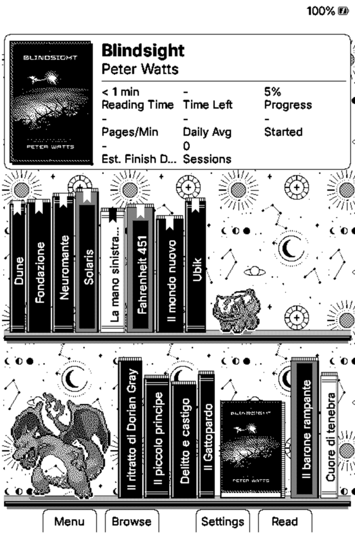

# Xteink Pokémon CrossLingua

Firmware for the Xteink X3, X4 and X4 Pro e-readers that combines two existing projects
in one build:

- the **reading-powered Pokémon game** from
  [thebitsworld/xteink-pokemon-game](https://github.com/thebitsworld/xteink-pokemon-game) -
  real page turns train your lead Pokémon, trigger wild encounters and item finds, and let
  you build a party, battle gyms, and complete a Pokédex, all driven by time spent
  actually reading;
- **bilingual reading (Lingua)** from
  [ed-fruty/crosslingua-reader](https://github.com/ed-fruty/crosslingua-reader) -
  translate an EPUB on the device and read it in eight bilingual display modes.

On top of that, this repository adds features of its own - a Bookshelf home that shows
your library as a bookcase, and syncing your Pokémon save, reading stats and book
position with a nearby reader in one go. See [What's new in this fork](#whats-new-in-this-fork).

## Projects this is built from

| Repository | What it contributes |
| --- | --- |
| [thebitsworld/xteink-pokemon-game](https://github.com/thebitsworld/xteink-pokemon-game) | The Pokémon game this fork started from: battles, gyms, Elite Four, items, Pokédex, X4 Pro support, the SD-card artwork pack. Pokémon game changes are merged from there. |
| [ed-fruty/crosslingua-reader](https://github.com/ed-fruty/crosslingua-reader) | CrossLingua, a CrossPoint Reader-based firmware focused on bilingual reading. Its Lingua module (translation, bilingual display modes) is merged into this build. |
| [uxjulia/CrossInk](https://github.com/uxjulia/CrossInk) | The reader firmware underneath both: reading sessions, dashboards, nearby (ESP-NOW) transfers, settings, updates. |
| [crosspoint-reader/crosspoint-reader](https://github.com/crosspoint-reader/crosspoint-reader) | The original open-source Xteink firmware CrossInk and CrossLingua are both based on. |
| [padge01/xteink-pokemon-game](https://github.com/padge01/xteink-pokemon-game) | The original idea of a reading-powered Pokémon companion. |

## What's new in this fork

### Bookshelf home

A Home screen style that turns your library into a bookcase, over a celestial wallpaper
of moons, stars and constellations (**Settings → Display → UI Theme → Bookshelf**):

- **The book you are reading** at the top, in a compact panel: cover, title, author and
  CrossInk's reading stats for it - reading time, time left, progress, pages per minute,
  daily average, start date, estimated finish date and sessions.
- **A shelf of the books you have read** and **a shelf of random books from your SD card
  you have not opened yet** - mostly standing spine-out with the title along the spine,
  each with its own height, thickness and binding, a few face-on with their cover. A
  ribbon marks a book in progress, a tick a finished one.
- **Your Pokémon on the shelves**: the first two Pokémon of your party sit among the
  books, cut out of their Pokédex cards.
- Tap a book (X4 Pro), or frame it with the side buttons and press Read (X3/X4), to open it.

Full guide: [Bookshelf Home](docs/bookshelf-home.md).

 

### Bilingual reading (Lingua)

Translate a chapter or a whole EPUB on the device, or use translations already embedded
by a Calibre workflow, then switch freely between eight display modes without
re-translating: Normal, Interleaved, Side by Side, Original Only, Translation Only,
Tooltip, Page Translation and Interlinear. Google (free) and Azure work without an API
key; DeepL, OpenAI, DeepSeek and Gemini work with your own key. Wi-Fi is only needed
while translating - the bilingual copy is stored on the SD card next to the original book,
which is never modified. Open a book, press **Confirm** and choose **Lingua**. Full guide:
[Lingua](docs/lingua.md).

### Book assistant (Gemini)

Back to a book after a break, or lost track of who someone is? Open the reader menu and choose
**Book assistant**. Google Gemini can recap the last pages you read, list the main characters so
far, answer a question you type, or tell you who a name you select on the page is. It answers
in your interface language from the book up to your page only, so it does not spoil what comes
next. It needs a free Gemini API key from Google AI Studio and Wi-Fi. Full guide:
[Book Assistant](docs/book-assistant.md).

### Pokémon save transfer between readers

Send your whole Pokémon game (party, PC Box, Bag, Pokédex, badges, movesets, IVs/EVs and
Hall of Fame) directly to another nearby reader over ESP-NOW - no Wi-Fi network, internet
or computer needed, and it works between X3, X4 and X4 Pro.

- **Pokémon → Settings → Send Save / Receive Save.** A reader with no game yet can
  receive from the starter screen.
- **Copy** keeps the save on both readers; **Move** hands it over and starts a new game
  on the sender.
- The receiver sees a summary (lead Pokémon, level, badges, Pokémon caught) and must
  accept it.
- Every file is checksummed, the save is only committed once it has fully arrived and been
  verified, installing it survives a power cut, and any save that gets replaced is kept in
  `/.crosspoint/pokemon-backup/`. A save from newer firmware is refused instead of loaded.

Full guide: [Pokémon Save Transfer](docs/pokemon-save-transfer.md).

### Sync everything with one button

**File Transfer → Sync with Nearby Reader** syncs the Pokémon save, the reading stats
(both ways) and the position in the book you last had open, in a single ESP-NOW transfer.
The book position lands on the same text even if the other reader lays the book out
differently, and if the other reader doesn't have the book yet, the EPUB is copied too. Full guide: [Sync with Nearby Reader](docs/nearby-sync.md).

### Updates from this repository

The in-app Wi-Fi **Check for Update** looks for new versions in this repository's
releases, so updating keeps Lingua and save transfer instead of replacing them with the
original Pokémon firmware.

See [CHANGELOG.md](CHANGELOG.md) for every release.

## How the Pokémon game works

For the full picture — Gym Leaders, evolution, the Pokédex, Trainer Card, Hall of Fame,
shiny Pokémon, and an honest list of what's simplified from the original games — see
[The Pokémon game](docs/pokemon-game.md). Short version:

Put the Pokémon you want to train at the top of your Party. As you read, it gains experience and levels up, learning new moves along the way.

While you read, wild Pokémon encounters and item finds happen on their own — a `!` on the dashboard tells you something is waiting in the Pokémon menu. Meeting a wild Pokémon starts a short turn-based battle: weaken it, then throw a Poké Ball to try to catch it. Balls, potions, status-curing items, and TMs/HMs are found the same way, just while reading.

Once your team is strong enough, challenge the eight Gym Leaders, the Elite Four, and finally the Champion, in order, to earn badges and complete the challenge. Evolution stones, level-up evolutions, and a full 151-entry Pokédex round out the loop.

Only active reading counts — leaving a book open without turning pages does not train your Pokémon.

## Screenshots

These are current X3 simulator captures using the artwork from `xteink-pokemon-sd-card-assets.zip`.

| Starter selection | Pokémon menu |
| --- | --- |
|  |  |

| Party | Summary |
| --- | --- |
|  |  |

| Pokédex | Pokédex entry |
| --- | --- |
|  |  |

| Battle | Bag |
| --- | --- |
|  |  |

| Trainer Card |
| --- |
|  |

## How to play

1. Choose Bulbasaur, Charmander, Squirtle, or Pikachu as your first partner. Choose its gender and give it a nickname if you want one.
2. Put the Pokémon you want to train at the top of your Party. Only your lead Pokémon gains experience while you read.
3. When a `!` appears on the dashboard, open the Pokémon menu to see what happened.
4. Meeting a wild Pokémon opens a battle — fight it down, then throw a ball to try to catch it, or run. Your Party holds six; additional Pokémon go to the PC Box.
5. Reorder your Party and deposit or withdraw Pokémon from the PC Box.
6. Manage moves from a Pokémon's Summary screen, use items and TMs/HMs from the Bag, and use evolution stones or Link Cables when you have them. Level-based evolutions ask before changing your Pokémon and can be turned off from its summary.
7. Once your team can handle it, take on the Gym Leaders in order from the Pokémon menu to earn badges, then the Elite Four, then the Champion.
8. Fill the original 151 Pokédex entries by catching and evolving Pokémon.

## Download and install

- [Download from GitHub Releases](https://github.com/davide-tonetto-884585/xteink-pokemon-crosslingua/releases)

Confirmed working on physical hardware on **Xteink X3**, **Xteink X4**, and **Xteink X4
Pro** (X4 Pro has a touch-only UI, portrait orientation), including both locked and
unlocked devices. **X3/X4 and X4 Pro firmware are not interchangeable** — they target
different chips (ESP32-C3 vs. ESP32-S3), though the updater checks for this and refuses a
mismatched file rather than bricking anything. Do not install on Sticky or another device.

| Your device | Download |
| --- | --- |
| Xteink X3 or Xteink X4 | [Latest X3/X4 firmware](https://github.com/davide-tonetto-884585/xteink-pokemon-crosslingua/releases/latest/download/xteink-pokemon-x3-x4-firmware-latest.bin) |
| Xteink X4 Pro | [Latest X4 Pro firmware](https://github.com/davide-tonetto-884585/xteink-pokemon-crosslingua/releases/latest/download/xteink-pokemon-x4-pro-firmware-latest.bin) |

Copy the `.bin` to the SD card and use **Settings → System → SD Card Firmware Update**.
Once you are on this firmware, later versions also install over Wi-Fi from **Settings →
System → Updates → Check for Updates** (a reader still running the original Pokémon
firmware checks that project's releases instead, so the first install has to be manual).
Either way, you also need the Pokémon artwork: download `xteink-pokemon-sd-card-assets.zip`
from the [original Pokémon game's releases](https://github.com/thebitsworld/xteink-pokemon-game/releases)
(this repository's releases ship firmware only) and copy its `pokemon` folder to the SD
card root — that's the Pokémon sprites, item icons, badges, and Pokédex cards, shipped
separately from the firmware. Full walkthrough, including what to do if
something doesn't match: [Installation](docs/installation.md).

Your books, reading data, and Pokémon save are never touched by an update — see
[The Pokémon game](docs/pokemon-game.md#your-save-is-separate-from-your-books).

Building from source? See [Getting Started](docs/development/getting-started.md).

## Credits

- [thebitsworld](https://github.com/thebitsworld/xteink-pokemon-game): the Pokémon game this fork is based on
- [ed-fruty](https://github.com/ed-fruty/crosslingua-reader): CrossLingua and its Lingua bilingual reading module
- [padge01](https://github.com/padge01/xteink-pokemon-game): the original idea for a reading-powered Pokémon companion on the Xteink X3, which this project builds on
- [CrossInk](https://github.com/uxjulia/CrossInk): the reader firmware, reading-session tracking, dashboards, and foundation for this project
- [CrossPoint Reader](https://github.com/crosspoint-reader/crosspoint-reader): the original firmware and upstream 1.5 improvements brought into this CrossInk build
- [Joshua Miller's CrossPoint Reader Companion](https://github.com/JoshuaMillerCode/crosspoint-reader-companion): the reading companion concept and verified-reading behavior
- [PokeAPI Sprites](https://github.com/PokeAPI/sprites): the source for the adapted Pokémon sprites
- [u/xDaftTurtle's Pokédex sleep-screen project](https://www.reddit.com/r/XTEINK/comments/1ve0pr4/comment/p1lpy0w/?context=3): the adapted X3 Pokédex cards, created with [Tesserae](https://github.com/dmellok/tesserae)
- [Pokémon Database](https://pokemondb.net/red-blue/gymleaders-elitefour): the source for the adapted Gym Leader, Elite Four, and Champion portraits

See [NOTICE.md](NOTICE.md) and [Rights and attribution](RIGHTS_AND_ATTRIBUTION.md). Project code is covered by the inherited [MIT License](LICENSE).

Pokémon and related names, characters, and artwork belong to their respective rights holders. This is an unofficial fan project and is not affiliated with or endorsed by Nintendo, Creatures Inc., GAME FREAK Inc., The Pokémon Company, Xteink, CrossInk, CrossLingua, or CrossPoint Reader.

## Development notes

- [Release checklist](docs/release-checklist.md)
- [Artwork and packaging](docs/artwork-setup.md)
- [Save-file formats](docs/file-formats.md) (including the save-transfer bundle)
