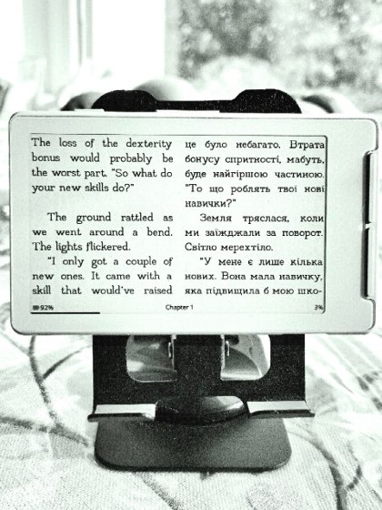

# Lingua

Lingua is available on every CrossLingua target: Xteink X3, X4, X4 Pro, and
M5Stack Paper Mono. The same translation modes and workflows are shared across
the button-only and touch/frontlight devices.

Lingua is CrossLingua's bilingual reading system. It can produce a bilingual
copy of any EPUB on the device or use language-tagged translations already
embedded by a Calibre workflow. The current code provides eight display modes:
Normal, Interleaved, Side by Side, Original Only, Translation Only, Tooltip,
Page Translation, and Interlinear.


*Interlinear mode on an Xteink reader.*

## What it does

- Translates a single chapter or the whole book on demand
- Stores the bilingual copy on the SD card next to the original
- Re-uses the translation when you re-open the book — no network needed after the first pass
- Lets you switch between several display modes without re-translating
- Recognizes translated paragraphs embedded in bilingual EPUBs

## What it doesn't do

- It is **not** an on-the-fly translator that renders the page you are looking
  at through a live translation engine (separate PR).
- It does not modify your EPUB files.

## Setup

### 1. Pick your engine (optional)

Default is Google V2 (Free) which needs no API key. Azure is also keyless.
For DeepL, OpenAI, DeepSeek, Gemini, or other engines requiring
authentication, enter your API key under **API Key** (the row only appears
for engines that need one).

### 2. Translate

Open a book, press **Confirm**, and select **Lingua**. Start **Translate
Chapter** or **Translate Book**, then choose the target and source languages
in the translation flow. The source language can be detected automatically.

- **Translate Chapter** — fastest. ~30 seconds for a typical chapter
  over WiFi.
- **Translate Book** — full book. ~4 minutes for a typical novel.

You can press **Back** to cancel at any time. Cancelling mid-chapter
leaves the chapter un-translated (the partial file is discarded).

## Display Modes

Once any chapter is translated, set **Display Mode** in the Lingua
submenu. The mode applies to all translated chapters in the current book.

### Normal

Renders everything inline as the bilingual EPUB stores it — original and
translation interleaved without coloring. Use this when reading bilingual
EPUBs prepared elsewhere (e.g. Calibre's Polyglot output).

### Interleaved

Like Normal — original and translation alternate paragraph by paragraph —
but translated paragraphs are drawn in gray so you can tell them apart at a
glance.

The gray level is a separate stored setting (**Dimmed** or **Dimmed
Light**), not a mode of its own. It affects drawing only: switching shade
never re-lays out the chapter.

> Earlier builds exposed the two shades as two separate display modes
> ("Dark" and "Light"). They are now one mode plus a shade setting; an
> existing setting saved under either old mode is migrated automatically on
> upgrade.

### Original Only

Drops translated paragraphs from the page. The book looks identical to the
untranslated original — useful when you want to read in the source language
and only consult translations occasionally.

### Translation Only

Drops original paragraphs. The book reads as if it were monolingual in
your target language.

### Side by Side

Lays each source paragraph and its translation into synchronized left and
right columns. The translation column can be Black, Grey, or Light Grey.



### Page Translation

The reader shows only the original text on each page. **Long-press either
side button** to bring up an overlay with the translations of the
paragraphs visible on the current page.

*Long-press to open, side buttons scroll, Back to close.*

In Page Translation mode, when a paragraph spans page boundaries (starts on one page
and continues on the next), the overlay shows only the translation of the
sentences actually visible on the current page — not the whole paragraph.

The overlay controls can use either the front or side button pair. Translation
text can use the same size as the book or one step smaller.

### Tooltip

Shows the original page and reveals one translated sentence at a time in a
small overlay. Sentence stepping can use either the front or side button pair.
At a page boundary it can either loop within the current page or turn the page
and continue. Translation text can use the same size as the book or one step
smaller.


### Interlinear

Places compact translated annotations above the source lines they belong to.
The annotation colour can be Black, Grey, or Light Grey, and the annotation
size can be 8 pt (the default), 10 pt, or 12 pt. Changing the size re-lays the
chapter out, since taller annotation rows leave fewer lines for the source text
on each page. All three stay narrower than the body text, which is what keeps a
sentence's translation above its own source lines most of the time.

A larger annotation size needs more room per sentence, and a translation is
often longer than the sentence it translates. When one does not fit the strips
above its own source lines, the tail is carried into the following strips
rather than cut, so no translated text is lost. The trade is that a carried
tail sits above a later source line than the sentence it belongs to, so the
bigger the annotation size, the further the translation can drift from its
sentence. At 8 pt this almost never happens; at 12 pt it is occasional.

If a paragraph's translation outruns every strip above it, the remainder is
drawn as small-type lines directly below the paragraph, with no source line
between them.

## Mode switching with no translation

If you switch to any non-Normal mode but the current chapter hasn't been
translated, the device shows a notice and reverts to Normal mode. Translate
the chapter (or the book) before selecting a translation-dependent mode.

## Re-translating

If a chapter is already translated, the menu shows **Re-translate Chapter**
instead of "Translate Chapter". It offers two options:

- **Translate missing only**: keeps the existing translation and sends only
  the paragraphs still in the original language (for example after a network
  error). If nothing is missing, no request is made.
- **Re-translate All**: translates the chapter again from scratch. Useful if
  you change target language or engine. The previous translation is kept if
  every request fails.

**Re-translate Book** offers the same two options. With **Translate missing
only**, chapters without a translation are translated in full and the others
are completed. This is also how you resume after a cancel.

## Progress and summary

While translating, the screen shows the book, the languages and the engine,
the progress of the chapter (and of the whole book), how many paragraphs were
translated or failed, the elapsed time and an estimate of the time left. On
touch devices, tap the bottom of the screen to cancel.

When it finishes, a summary shows the counts and the total time. If some
paragraphs failed, **Retry missing (N)** translates only those. **Continue**
opens the display-mode chooser.

Long paragraphs are split at sentence ends and sent in pieces, and each
request is tried up to 3 times before it counts as failed.

## Deleting translations

To free SD card space or start fresh, pick **Delete Translations** in the
Lingua submenu. This removes all bilingual copies for the current
book but leaves the original EPUB untouched.

## How it stores translations

Bilingual copies are written to:

```
.crosspoint/epub_<hash>/sections/<N>.translated.html
```

They survive font/size changes (which invalidate layout cache) and reboot.
They are tied to the EPUB's file hash — moving or renaming the EPUB
invalidates them.

## Translation engines

| Engine | Authentication | Notes |
|---|---|---|
| Google (Free) - New | None | Default. Uses `translate.googleapis.com/translate_a/single`. Best free choice. |
| Google (Free) - HTML | None | Google free with HTML preservation. |
| Google (Free) - Old | None | Legacy free endpoint. |
| DeepL | API key | Free tier — 500k chars/month. |
| DeepL Pro | API key | Paid. |
| OpenAI | API key | Translation via chat-completion API. |
| DeepSeek | API key | Translation via DeepSeek chat API. |
| Gemini | API key | Translation via Google Gemini API. |
| Azure | None | Microsoft's Edge-browser translator endpoint. Keyless — see below. |

### Azure

Azure needs **no API key and no region**: pick it in the engine cycler and
translate. It calls `api-edge.cognitive.microsofttranslator.com`, the
deployment behind Microsoft Edge's built-in page translator, and
authenticates with a short-lived bearer token fetched anonymously from
`edge.microsoft.com/translate/auth` (cached for 8 minutes — normally one
fetch per chapter, renewed between batches on a chapter long enough to
outlive it). No credentials of any kind are sent.

This is **not** the paid Azure Translator resource
(`api.cognitive.microsofttranslator.com`), which would require a
subscription key plus a region. Neither Edge endpoint is a documented,
supported API, so Microsoft can change or withdraw them without notice —
the same durability caveat that applies to the free Google engines.

Azure is one of the engines that batches: a whole batch of paragraphs goes
out as a single array of text items and comes back as one result per item,
in order, so it makes far fewer requests per chapter than the per-paragraph
engines. Chinese targets are sent as `zh-Hans` / `zh-Hant`, Norwegian as
`nb` and Serbian as `sr-Cyrl`, which are the codes Azure's language list
uses.

## Notes

- **Network required only during translation.** Once translated, the book
  reads offline.
- **CJK sentence detection** is limited in v1 — paragraphs straddling pages
  in Page Translation mode may show the whole translated paragraph rather than the
  sentences corresponding to visible text. Latin, Cyrillic, Greek, and
  Vietnamese punctuation work correctly.
- **Translation engines have rate limits.** Google Free can throttle on
  long sessions. DeepL Free has a 500k char/month cap.
- **Translation API security.** Requests are encrypted (TLS) but the
  server certificate is not verified, matching the firmware's standard
  HTTPS stack. API keys for paid engines (DeepL, OpenAI, DeepSeek,
  Gemini) travel over this connection; treat them as you would any
  credential on an untrusted network. The free Google engines and Azure
  send only the text being translated.
- The first run takes longer than re-runs — chapter layouts re-index after
  translation completes.
